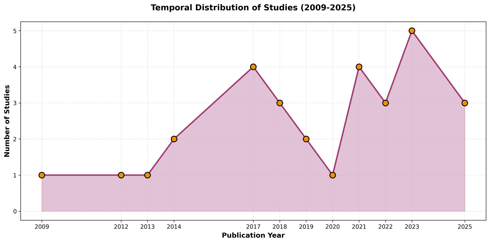
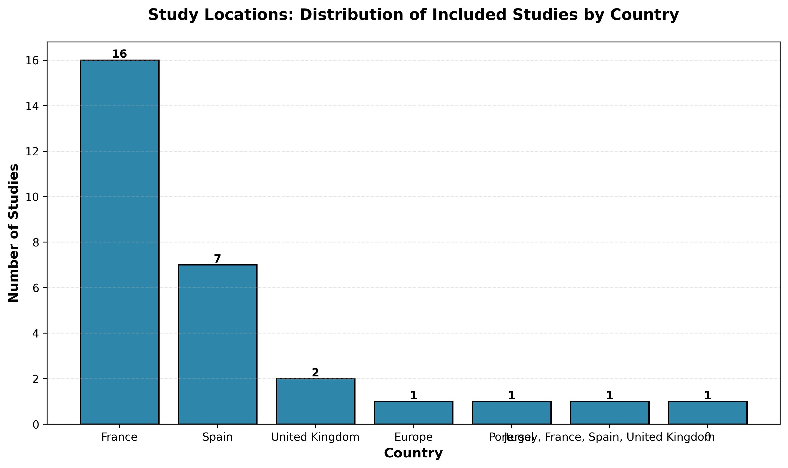

# Impact van Vespa velutina op Apis mellifera in Europa
_Als bijen alleen nectar verzamelden van perfecte bloemen, zouden ze niet eens één druppel honing kunnen maken_ – Matshona Dhliwayo

- **Status:** Compleet - klaar voor maandelijkse updates
- **Bijgewerkt:** 2025-11-08
- Click [here](../README.md) for the English version.

## Samenvatting

Deze repository synthetiseert bewijs uit **30 wetenschappelijke studies** om de impact van de Aziatische hoornaar (_Vespa velutina_) op gedomesticeerde honingbijkolonies (_Apis mellifera_) in Europa te kwantificeren.

### Predatiedruk op _Apis mellifera_
- **Honingbij in dieet**: 22-98% afhankelijk van methode en locatie — [zie details](#422-prooisamenstelling)
- **Per _Vespa velutina_ kolonie consumptie**: 
  - **11,32 kg** insecten per seizoen
  - **97.246 honingbij-equivalent** per seizoen
- **Waargenomen _Vespa velutina_ tellingen bij bijenstanden**: 
  - 0-4: Lage druk (waargenomen in studies)
  - 5-9: Matige druk (minimum risicodrempel: Diéguez-Antón et al. 2025)
  - 10-12: Hoge druk (foerageerafname waargenomen: Monceau et al. 2018)
  - ≥13: Zeer hoge druk (foerageerparalyse drempel: Requier et al. 2019)
- **Piekperioden**: juli-oktober (varieert per locatie) — [zie details](#422-prooisamenstelling)
- **Predatiesuccespercentage**: 2,4% (videotracking van natuurlijke predatie bij kastingang) — [zie details](#421-predatiesnelheden-en-succes)

### Overleving van gedomesticeerde honingbijkolonies
- **Zonder bescherming**: **35-56%** van de kolonies overleeft onder hoge _Vespa velutina_ druk (Requier et al. 2020; Rojas-Nossa et al. 2022) — [zie details](#431-kolonie-overleving)
- **Met bescherming** (elektrische harpen, snuitmaskers): **55-78%** overleving (Requier et al. 2020; Rojas-Nossa et al. 2022) — [zie details](#431-kolonie-overleving)
- **Timing van kolonieverliezen**: 
  - Tijdens predatieperiode: **2,5%** van de kolonies (Requier et al. 2019)
  - Tijdens winter (januari-mei): Meerderheid van verliezen treedt op (Requier et al. 2019)
- **Risicodrempel**: **≥5 _Vespa velutina_** bij bijenstand (Diéguez-Antón et al. 2025) — [zie details](#432-mortaliteitsfactoren)
- **Kolonieverlies**: is multifactorieel, de invloed van _Vespa velutina_ kan niet worden gescheiden van andere oorzaken van kolonieverlies — [zie details](#43-kolonie-overleving-en-verlies)

### Gedragsveranderingen van _Apis mellifera_
- **Foerageerparalyse drempel**: **≥12,6 _Vespa velutina_** aanwezig (Requier et al. 2019) — [zie details](#441-foerageerparalyse-drempelwaarden)
- **Foerageerafname drempel**: **>10 _Vespa velutina_** per kast (Monceau et al. 2018)
- **Activiteitsreductie met bescherming**: Tot **41%** reductie in foerageerparalyse (Requier et al. 2020) — [zie details](#441-foerageerparalyse-drempelwaarden)
- **Defensief gedrag effectiviteit** (*Apis mellifera*):
  - Natuurlijke omstandigheden (buiten kast): **9,5%** van _Vespa velutina_ gedood door balling (Arca et al. 2014)
  - Experimentele omstandigheden (in kast): **76,4%** gedood (Arca et al. 2014)
  - Opmerking: _Vespa velutina_ gaan niet natuurlijk kasten binnen; dit was experimenteel — [zie details](#442-activiteitsreducties)
- **Gevolg**: Foerageerparalyse leidt tot kolonieverhongering en wintersterfte (Requier et al. 2019) — [zie details](#44-apis-mellifera-gedrag)

### Economische impact van _Vespa velutina_ op _Apis mellifera_
- **Databron**: InvaCost database — [zie details](#453-invacost-database)
- De InvaCost database biedt een uitgebreide wereldwijde repository van economische kosten van invasieve uitheemse soorten, inclusief *Vespa velutina*. Data kan worden benaderd via de website, GitHub repository, of R package voor analyse.

### Snelle Referentie: Kern Drempelwaarden en Observaties

| Metriek | Drempel/Observatie | Studie | Context |
|--------|----------------------|-------|---------|
| Minimum risico | ≥5 _Vespa velutina_ bij bijenstand | Diéguez-Antón et al. 2025 | Kolonie overlevingsrisico |
| Hoog risico | ≥10 _Vespa velutina_ bij bijenstand | Diéguez-Antón et al. 2025 | Kolonie overlevingsrisico |
| Foerageerafname | >10 _Vespa velutina_ per kast | Monceau et al. 2018 | Bijengedrag |
| Foerageerparalyse | ≥12,6 _Vespa velutina_ | Requier et al. 2019 | Volledige foerageerstop |
| Piek predatieperiode | Juli-oktober | Meerdere | Seizoenspatroon |
| Piek dagelijkse activiteit | 13:00-15:00 uur | Meerdere | Tijdstip van de dag |
| Optimale temperatuur | 15-26°C | Diéguez-Antón et al. 2022, 2025 | _Vespa velutina_ activiteit |
| Kolonie overleving (onbeschermd) | 35-56% | Requier et al. 2020; Rojas-Nossa et al. 2022 | Hoge druk omstandigheden |
| Kolonie overleving (beschermd) | 55-78% | Requier et al. 2020; Rojas-Nossa et al. 2022 | Met beschermingsmaatregelen |

## Inhoudsopgave
- [Samenvatting](#samenvatting)
  - [Predatiedruk op _Apis mellifera_](#predatiedruk-op-apis-mellifera)
  - [Overleving van gedomesticeerde honingbijkolonies](#overleving-van-gedomesticeerde-honingbijkolonies)
  - [Gedragsveranderingen van _Apis mellifera_](#gedragsveranderingen-van-apis-mellifera)
  - [Economische impact van _Vespa velutina_ op _Apis mellifera_](#economische-impact-van-vespa-velutina-op-apis-mellifera)
  - [Snelle Referentie: Kern Drempelwaarden en Observaties](#snelle-referentie-kern-drempelwaarden-en-observaties)
- [1. Literatuurzoekacties](#1-literatuurzoekacties)
  - [1.1 Trefwoorden](#11-trefwoorden)
  - [1.2. Databasesearch](#12-databasesearch)
  - [1.3 Citation chaser](#13-citation-chaser)
  - [1.4 Deduplicatie](#14-deduplicatie)
- [2. Fase I screening](#2-fase-i-screening)
  - [2.1. ASReview LAB screening](#21-asreview-lab-screening)
  - [2.2 PDF's downloaden](#22-pdfs-downloaden)
- [3 Fase II screening](#3-fase-ii-screening)
  - [3.1 Volledige-tekst screening](#31-volledige-tekst-screening)
  - [3.2 Code template voorbereiding](#32-code-template-voorbereiding)
- [4 Data Extractie](#4-data-extractie)
  - [4.1 Data Extractie](#41-data-extractie)
  - [4.2 Predatie Data](#42-predatie-data)
    - [4.2.1 Predatiesnelheden en Succes](#421-predatiesnelheden-en-succes)
    - [4.2.2 Prooisamenstelling](#422-prooisamenstelling)
  - [4.3 Kolonie Overleving en Verlies](#43-kolonie-overleving-en-verlies)
    - [4.3.1 Kolonie Overleving](#431-kolonie-overleving)
    - [4.3.2 Mortaliteitsfactoren](#432-mortaliteitsfactoren)
  - [4.4 Apis mellifera gedrag](#44-apis-mellifera-gedrag)
    - [4.4.1 Foerageerparalyse Drempelwaarden](#441-foerageerparalyse-drempelwaarden)
    - [4.4.2 Activiteitsreducties](#442-activiteitsreducties)
  - [4.5 Economische Impact](#45-economische-impact)
    - [4.5.1 Kolonie Verlies Kosten](#451-kolonie-verlies-kosten)
    - [4.5.2 Andere Landen](#452-andere-landen)
    - [4.5.3 Invacost Database](#453-invacost-database)
  - [4.6 Achtergronddata](#46-achtergronddata)
    - [4.6.1 Studielocaties](#461-studielocaties)
    - [4.6.2 Bijenstanden en Kolonies](#462-bijenstanden-en-kolonies)
    - [4.6.3 Bestudeerde _Vespa velutina_ Nesten](#463-bestudeerde-vespa-velutina-nesten)
  - [4.7 Beperkingen](#47-beperkingen)
  
## Projectoverzicht

Bijna een kwart eeuw is verstreken sinds _Vespa velutina_ per ongeluk in Europa arriveerde. En deze Aziatische hoornaar (_Vespa velutina_) met haar gele poten gebruikt haar vleugels om zich te verspreiden over een groot deel van Europa. Volwassen werksters hebben eiwitrijke prooien nodig om de ontwikkelende larven in hun nesten te voeden, die ze voornamelijk uit insecten halen. Ze maken het zichzelf niet moeilijk—in Europa zijn gedomesticeerde bijen (_Apis mellifera_) ruim beschikbaar en gemakkelijk te vangen. Laten we dus uitzoeken wat er gepubliceerd is over de bijdrage van de **gele poten hoornaar** (_Vespa velutina_) aan de achteruitgang van Westerse **honingbij**populaties.

**Populatie:** _Apis mellifera_ kolonies in Europa

**Vergelijking:** Kolonies zonder _Vespa velutina_ predatie/aanwezigheid

**Uitkomst:** Impactmetingen inclusief:
- _Apis mellifera_ Predatiesnelheden
- _Apis mellifera_ Kolonieverlies
- _Apis mellifera_ gedragsveranderingen
- Economische impact van _Vespa velutina_ op _Apis mellifera_

**Beperkingen**
- Studies over de impact van _Vespa velutina_ op _Apis mellifera_ zijn geen perfecte bloemen
  - Hoge methodologische heterogeniteit
  - Inconsistente uitkomstmetingen
  - Gebrek aan expliciete controlegroepen
  - Dit overzicht is beperkt tot gratis online literatuurdatabases en beschikbare PDF's.

## 1. Literatuurzoekacties
**Bijgewerkt:** 2025-10-30

### 1.1 Trefwoorden
- **Vespa velutina:** ("vespa velutina" OR "asian hornet" OR "yellow-legged hornet")
- AND
- **Apis mellifera:**  ("apis mellifera" OR honeybee* OR "honey bee*" OR beekeep* OR apiary* OR "managed pollinator*" OR "bee colony" OR "bee colonies")
- AND
(Europe OR European OR 
Austria OR Austrian OR 
Belgium OR Belgian OR 
Bulgaria OR Bulgarian OR 
Croatia OR Croatian OR 
Cyprus OR Cypriot OR 
Czech OR "Czech Republic" OR "Czechia" OR 
Denmark OR Danish OR 
Estonia OR Estonian OR 
Finland OR Finnish OR 
France OR French OR 
Germany OR German OR 
Greece OR Greek OR 
Hungary OR Hungarian OR 
Ireland OR Irish OR 
Italy OR Italian OR 
Latvia OR Latvian OR 
Lithuania OR Lithuanian OR 
Luxembourg OR Luxembourgish OR 
Malta OR Maltese OR 
Netherlands OR Dutch OR 
Poland OR Polish OR 
Portugal OR Portuguese OR 
Romania OR Romanian OR 
Slovakia OR Slovak OR 
Slovenia OR Slovenian OR 
Spain OR Spanish OR 
Sweden OR Swedish OR 
"United Kingdom" OR Britain OR British OR England OR Scotland OR Wales OR "Northern Ireland")

### 1.2. Databasesearch

Alleen open access databases werden gebruikt.

[Lens.org](https://www.lens.org/lens/search/scholar/list?q=(%22vespa%20velutina%22%20OR%20%22asian%20hornet%22%20OR%20%22yellow-legged%20hornet%22)%20AND%20(%22apis%20mellifera%22%20OR%20honeybee*%20OR%20%22honey%20bee*%22%20OR%20beekeep*%20OR%20apiary*%20OR%20%22managed%20pollinator*%22%20OR%20%22bee%20colony%22%20OR%20%22bee%20colonies%22)%20AND%20(Europe%20OR%20European%20OR%20%20Austria%20OR%20Austrian%20OR%20%20Belgium%20OR%20Belgian%20OR%20%20Bulgaria%20OR%20Bulgarian%20OR%20%20Croatia%20OR%20Croatian%20OR%20%20Cyprus%20OR%20Cypriot%20OR%20%20Czech%20OR%20%22Czech%20Republic%22%20OR%20%22Czechia%22%20OR%20%20Denmark%20OR%20Danish%20OR%20%20Estonia%20OR%20Estonian%20OR%20%20Finland%20OR%20Finnish%20OR%20%20France%20OR%20French%20OR%20%20Germany%20OR%20German%20OR%20%20Greece%20OR%20Greek%20OR%20%20Hungary%20OR%20Hungarian%20OR%20%20Ireland%20OR%20Irish%20OR%20%20Italy%20OR%20Italian%20OR%20%20Latvia%20OR%20Latvian%20OR%20%20Lithuania%20OR%20Lithuanian%20OR%20%20Luxembourg%20OR%20Luxembourgish%20OR%20%20Malta%20OR%20Maltese%20OR%20%20Netherlands%20OR%20Dutch%20OR%20%20Poland%20OR%20Polish%20OR%20%20Portugal%20OR%20Portuguese%20OR%20%20Romania%20OR%20Romanian%20OR%20%20Slovakia%20OR%20Slovak%20OR%20%20Slovenia%20OR%20Slovenian%20OR%20%20Spain%20OR%20Spanish%20OR%20%20Sweden%20OR%20Swedish%20OR%20%20%22United%20Kingdom%22%20OR%20Britain%20OR%20British%20OR%20England%20OR%20Scotland%20OR%20Wales%20OR%20%22Northern%20Ireland%22))
- Laatst geraadpleegd: 2025-10-30 
    - 767 records

[Open Alex](https://openalex.org/works?page=1&sort=publication_year:desc&filter=title_and_abstract.search:(%22vespa+velutina%22+OR+%22asian+hornet%22+OR+%22yellow-legged+hornet%22)+AND+(%22apis+mellifera%22+OR+%22honey+bee%22+OR+%22beekeeping%22+OR+%22apiary%22+OR+%22managed+pollinator%22+OR+%22bee+colony%22)+AND+(Europe+OR+European+OR+Austria+OR+Belgium+OR+Bulgaria+OR+Croatia+OR+Cyprus+OR+Czech+OR+%22Czech+Republic%22+OR+Czechia+OR+Denmark+OR+Estonia+OR+Finland+OR+France+OR+Germany+OR+Greece+OR+Hungary+OR+Ireland+OR+Italy+OR+Latvia+OR+Lithuania+OR+Luxembourg+OR+Malta+OR+Netherlands+OR+Poland+OR+Portugal+OR+Romania+OR+Slovakia+OR+Slovenia+OR+Spain+OR+Sweden+OR+%22United+Kingdom%22),type:types/article)
- Laatst geraadpleegd: 2025-10-30
    - 67 artikelen
    - 5 preprints

[Pubmed](https://pubmed.ncbi.nlm.nih.gov/?term=%28+%22vespa+velutina%22%5Btiab%5D+OR+%22asian+hornet%22%5Btiab%5D+OR+%22yellow-legged+hornet%22%5Btiab%5D+%29+AND+%28+%22apis+mellifera%22%5Btiab%5D+OR+honeybee*%5Btiab%5D+OR+beekeep*%5Btiab%5D+OR+apiary*%5Btiab%5D+%29+AND+%28Europe+OR+European+OR+Austria+OR+Belgium+OR+Bulgaria+OR+Croatia+OR+Cyprus+OR+Czech+OR+%22Czech+Republic%22+OR+Czechia+OR+Denmark+OR+Estonia+OR+Finland+OR+France+OR+Germany+OR+Greece+OR+Hungary+OR+Ireland+OR+Italy+OR+Latvia+OR+Lithuania+OR+Luxembourg+OR+Malta+OR+Netherlands+OR+Poland+OR+Portugal+OR+Romania+OR+Slovakia+OR+Slovenia+OR+Spain+OR+Sweden+OR+%22United+Kingdom%22%29&sort=date)
- Laatst geraadpleegd: 2025-10-30
    - 56 artikelen

**Google Scholar** wordt gebruikt om te screenen op aanvullende artikelen of relevante grijze literatuur na de initiële literatuurzoekactie.
- Laatst geraadpleegd: 2025-10-30
    - 2.160 records ([gesorteerd op relevantie](https://scholar.google.com/scholar?hl=nl&as_sdt=0,5&as_vis=1&q=(%22vespa+velutina%22+OR+%22asian+hornet%22+OR+%22yellow-legged+hornet%22)+AND+(%22apis+mellifera%22+OR+%22honey+bee%22+OR+beekeeping+OR+apiary+OR+%22managed+pollinator%22+OR+%22bee+colony%22)+AND+(Europe+OR+European+OR+Austria+OR+Belgium+OR+Bulgaria+OR+Croatia+OR+Cyprus+OR+Czech+OR+%22Czech+Republic%22+OR+Czechia+OR+Denmark+OR+Estonia+OR+Finland+OR+France+OR+Germany+OR+Greece+OR+Hungary+OR+Ireland+OR+Italy+OR+Latvia+OR+Lithuania+OR+Luxembourg+OR+Malta+OR+Netherlands+OR+Poland+OR+Portugal+OR+Romania+OR+Slovakia+OR+Slovenia+OR+Spain+OR+Sweden+OR+%22United+Kingdom%22)&scisbd=1))
    - 168 records ([gesorteerd op datum](https://scholar.google.com/scholar?scisbd=2&q=(%22vespa+velutina%22+OR+%22asian+hornet%22+OR+%22yellow-legged+hornet%22)+AND+(%22apis+mellifera%22+OR+%22honey+bee%22+OR+beekeeping+OR+apiary+OR+%22managed+pollinator%22+OR+%22bee+colony%22)+AND+(Europe+OR+European+OR+Austria+OR+Belgium+OR+Bulgaria+OR+Croatia+OR+Cyprus+OR+Czech+OR+%22Czech+Republic%22+OR+Czechia+OR+Denmark+OR+Estonia+OR+Finland+OR+France+OR+Germany+OR+Greece+OR+Hungary+OR+Ireland+OR+Italy+OR+Latvia+OR+Lithuania+OR+Luxembourg+OR+Malta+OR+Netherlands+OR+Poland+OR+Portugal+OR+Romania+OR+Slovakia+OR+Slovenia+OR+Spain+OR+Sweden+OR+%22United+Kingdom%22)&hl=nl&as_sdt=0,5&as_vis=1)) 

### 1.3 Citation chaser
[Citation chaser](https://estech.shinyapps.io/citationchaser/)
- Initiële zoekactie 2025-10-30: 56 referenties

### 1.4 Deduplicatie
[Rayyan](https://new.rayyan.ai/)
- Geïmporteerde referenties: 915
- Gedetecteerde duplicaten: 347
- Unieke referenties voor fase I screening: 612

## 2. Fase I screening
### 2.1. ASReview LAB screening
[ASReview LAB](https://github.com/asreview/asreview) screening op basis van titel en abstract
#### Inclusiecriteria
- Taal is Engels, Nederlands of Duits
- Bevat predatiedata en/of secundaire effectdata
- Studievorm is observationeel of experimenteel met veldcomponent

#### Exclusiecriteria
- Geen Apis mellifera data
- Geen Vespa velutina data
- Niet-Europese locatie
- Niet Engels, Nederlands of Duits
- Simulatiestudies, modellen, voorspelling, laboratoriumomstandigheden
- Reviews (controleer op gemiste artikelen met citation chaser)
- Grijze literatuur
- Alleen nestverwijderingsmethoden (geen impactdata)
- Duplicaat (data) van reeds geïncludeerde studie

### 2.2 PDF's downloaden
- Gratis online: 32
- Gratis pre-print: 1
- PDF aangevraagd 2025-11-01: 1
- `pdf_phaseI.csv` bevat de lijst met de geïncludeerde artikelen voor fase II screening

## 3 Fase II screening
### 3.1 Volledige-tekst screening
Screening op basis van volledige tekst en aanvullend materiaal (indien beschikbaar). `_update_phase_II.md` wordt gebruikt om Cursor.AI te instrueren om de kwantitatieve items uit de PDF's te extraheren. Eerst worden inclusie- en exclusiecriteria geëxtraheerd, vervolgens worden aanvullende kwantificeerbare data geëxtraheerd. Korte notities waren toegestaan. De resultaten worden opgeslagen in een .md bestand met een vergelijkbare naam als de PDF. Vervolgens werden ze handmatig gecontroleerd, gecorrigeerd en aanvullende relevante informatie toegevoegd.
#### Geïncludeerd: 28
- Apis_mellifera_predation
- Other_species_predation
- Colony_loss
- Foraging_activity
- Other_behavior_changes
- Honey_yield
- Economic_loss
- Management_costs
#### Uitgesloten: 5
- Editorial: 1
- Review_ of _meta-analysis: 3
- No_quantifiable-data: 0
- Gray_literature: 0
- PDF_not_available: 1
- No original data (article based on invacost): 1
### 3.2 Code template voorbereiding
`_pdf_phase_II.csv` bevat de master dataset met alle geïncludeerde artikelen voor fase II screening en data extractie. Dit CSV bestand dient als primaire databron voor alle kwantitatieve analyses.

## 4 Data Extractie

**Kwantitatieve data** geëxtraheerd uit 34 studies (30 geïncludeerd, 4 uitgesloten) over de impact van *Vespa velutina* op *Apis mellifera* in Europa.

**Master Dataset**: `3_phase_II/_pdf_phase_II.csv` bevat alle geëxtraheerde kwantitatieve data, studiekenmerken, inclusie/exclusiecriteria, en uitkomstmetingen.

### 4.1 Data Extractie
Conceptuele data extractie van de kwantitatieve data voor elke PDF wordt gedaan met Cursor.ai en handmatig gecontroleerd.
### 4.2 Predatie Data

#### 4.2.1 Predatiesnelheden en Succes

**Kernmetrieken Samenvatting**

| Metriek | Waarde | Studie | Locatie |
|--------|-------|-------|----------|
| Algehele predatiesuccespercentage | 2,4% | Poidatz et al. 2023 | Frankrijk |
| Succespercentage (bijen die kast binnengaan) | 69,46% | Poidatz et al. 2023 | Frankrijk |
| Succespercentage (bijen die kast verlaten) | 15,27% | Poidatz et al. 2023 | Frankrijk |
| Piek succes (aantal _Vespa velutina_) | ~8 _Vespa velutina_ | Poidatz et al. 2023 | Frankrijk |
| Aanvalssuccespercentage | 25% | Perrard et al. 2009 | Frankrijk |
| Maximale vangsten (aantal _Vespa velutina_) | 9 _Vespa velutina_ | Monceau et al. 2013 | Frankrijk |

**Gedetailleerde Bevindingen**

**Poidatz et al. 2023** (Frankrijk)
- Algehele predatiesucces: **2,4%** (126 succesvolle gebeurtenissen uit 5.175 interacties)
- Succespercentage voor bijen die kast binnengaan: **69,46%** (4× hoger dan bijen die verlaten)
- Succespercentage voor bijen die kast verlaten: **15,27%**
- Piek succes treedt op bij **~8 _Vespa velutina_**, daarna neemt het af
- Steekproef: 5.175 predator-prooi interacties uit 603.259 trajecten

**Perrard et al. 2009** (Frankrijk, 2007)
- Aanvalssuccespercentage: **25%** (gemiddeld 4 pogingen nodig om één honingbij te vangen)
- Honingbij predatiesnelheid (gevangene kolonie): **37,5 honingbijen/dag** (bereik: 25-50)
- Steekproef: 359 waargenomen aanvallen, 1 gevangene kolonie

**Monceau et al. 2013** (Frankrijk, 2008-2009)
- Maximale vangsten bij **9 _Vespa velutina_ per kast**
- Piek vangsttijd: **13:00-14:00 uur** (middag)
- Gevangen _Vespa velutina_:
  - ART locatie: **916 individuen** (14 kasten), piek: 106 op 12 nov 2008
  - VIL locatie: **1.894 individuen** (9 kasten), piek: 217 op 12 nov 2008
- Predatieduur: **5 maanden**
- Vertraging tot predatie toename: **~44 dagen** vanaf eerste vangst
- Steekproef: 23 kasten over 2 locaties

**Monceau et al. 2014** (Frankrijk, 2011)
- Dagelijks bezoekende _Vespa velutina_: **~350 individuen** (6 kasten)
- Maximum _Vespa velutina_ bij enkele kast: **20 individuen** gelijktijdig
- Herinvangstpercentage: **56,67%** totaal (204/360 gemarkeerd), **73,94%** op D1 ochtend
- Dagelijkse bezoeken per halve dag: **1,88 bezoeken** (bereik: 1,70-2,20)
- Steekproef: 360 gemarkeerde _Vespa velutina_, 6 kasten

**Rome et al. 2021** (Frankrijk, 2008-2010)
- Piek predatietiming: **Begin oktober**
- Piek predatietijdstip van de dag: **Middag**
- Steekproef: 16 nesten

**Diéguez-Antón et al. 2025** (Spanje, 2021-2022)
- Totaal getelde _Vespa velutina_: **11.406 individuen** over alle bijenstanden (6 kolonies)
- Predatiedruk duur: Tot **11 maanden** (Bijenstand 3, beide jaren)
- Steekproef: 3 bijenstanden, 6 kolonies

#### 4.2.2 Prooisamenstelling

**Kernmetrieken Samenvatting**

| Metriek | Waardebereik | Methode | Studies |
|--------|-------------|--------|---------|
| Apis mellifera in dieet | 22,55% - 98,1% | Verschillend | Meerdere |
| Apis mellifera gevonden in alle nesten | 100% | Metabarcoding | Pedersen et al. 2025 |
| Prooiconsumptie per _Vespa velutina_ kolonie | 97.246 honingbij-equivalent/seizoen | Pellet analyse | Rome et al. 2021 |
| Biomassa consumptie per _Vespa velutina_ kolonie | 11,32 kg/seizoen | Pellet analyse | Rome et al. 2021 |
| Proportie kastproductie geconsumeerd | 40% | Pellet analyse | Rome et al. 2021 |

**Gedetailleerde Bevindingen**

**Rome et al. 2021** (Frankrijk, 2008-2010, 16 nesten, pellet verzameling)
- Apis mellifera in prooipellets: **38,1%** (820/2.151 pellets)
- Prooiconsumptie per _Vespa velutina_ kolonie: **97.246 honingbij-equivalent** per seizoen
- Biomassa consumptie per _Vespa velutina_ kolonie: **11,32 kg** insecten per seizoen
- Proportie van kastproductie geconsumeerd: **~40%** (één _Vespa velutina_ kolonie consumeert ~40% van individuen geproduceerd door één kast)
- Wilde bijen proportie: **0,02%** (hommels en solitaire bijen, exclusief wilde honingbijkolonies)

**Pedersen et al. 2025** (Meerdere landen, 2020-2022, 103 nesten, larvaal darminhoud)
- Apis mellifera prevalentie: **98,1%** gemiddeld (gevonden in elk nest)
- Apis mellifera gevonden in alle nesten: **100%**
- Top 50 prooisoorten: **43 waren potentiële bestuivers**
- Gewasbestuivers: **3 meest dominante Europese gewasbestuivers** geïdentificeerd

**Perrard et al. 2009** (Frankrijk, 2007, pellet analyse)
- Apis mellifera in pellets: **84,8%** (145/171 vleespellets)

**Herrera et al. 2025** (Spanje, Mallorca, 2016, 7 nesten, meconium analyse)
- Apis mellifera in dieet: **22,55%** van Apidae familie
- Bereik over nesten: **14,86-29,27%**
- Gedeelde OTU: Ja (gevonden in alle nesten)

**Verdasca et al. 2022** (Portugal, 2018, 12 nesten, metabarcoding)
- Honingbij reads:
  - Totaal: **75%** (79.143/108.979 reads)
  - Fecale pellets: **84%** (50.549/60.518 reads)
  - Kaken: **74%** (20.458/27.546 reads)
  - Magen: **39%** (8.136/20.915 reads)
- Detectiepercentages:
  - Fecale pellets: **100%** (alle replicaten)
  - Kaken: **70%**
  - Magen: **40%**
- DNA persistentie in fecale pellets: **≥28 dagen** (maximaal bekende periode)

**Stainton et al. 2023** (VK, 2016-2020, 5 nesten, larvaal darminhoud)
- Honingbij detectiepercentage: **65,8%** (25/38 larven)
- Detectie per nest: **80%** (4/5 nesten)
- Honingbij reads per locatie:
  - Jersey (2019): **20,5%** (9 monsters)
  - Tetbury (2016): **0,33%** (10 monsters)
  - Woolacombe (2017): **7,3%** (10 monsters)

### 4.3 Kolonie Overleving en Verlies

#### 4.3.1 Kolonie Overleving

**Kernmetrieken Samenvatting**

| Metriek | Waarde | Studie | Locatie |
|--------|-------|-------|----------|
| Beschermde kolonie overleving | 77,8% | Rojas-Nossa et al. 2022 | Spanje |
| Snuitmasker uitgeruste overleving | 55% | Requier et al. 2020 | Frankrijk |
| Onbeschermde kolonie overleving | 55,6% | Rojas-Nossa et al. 2022 | Spanje |
| Controle overleving (geen bescherming) | 35% | Requier et al. 2020 | Frankrijk |
| Kolonie instortingspercentage | 55,3% | Requier et al. 2019 | Frankrijk |

**Gedetailleerde Bevindingen**

**Requier et al. 2020** (Frankrijk, 2013-2016, BEEHAVE model simulaties)
- Snuitmasker uitgeruste overleving: **55%** (100 simulaties)
- Controle overleving: **35%** (100 simulaties)
- Overlevingsverhoging met bescherming: **Tot 51%** in context van hoge _Vespa velutina_ abundantie (>5 _Vespa velutina_)
- Lage _Vespa velutina_ belasting (<5): Snuitmasker overleving marginaal lager dan controle
- Hoge _Vespa velutina_ belasting (>5): Snuitmasker verhoogt significant overlevingskans

**Rojas-Nossa et al. 2022** (Spanje, 2018-2020, elektrische harp bescherming)
- Beschermde kolonie overleving: **77,8%**
- Onbeschermde kolonie overleving: **55,6%**
- Honingbij gewichtsreductie (onbeschermd): **6,7%** lichtere werksters

**Requier et al. 2019** (Frankrijk, 2012-2016, BEEHAVE model simulaties, 993 simulaties)
- Kolonie instortingspercentage: **55,3%** (549/993 bereikten eindpunt)
- Instorting tijdens predatieperiode: **2,5%** (24 kolonies)
- Instorting tijdens winter: 13 januari - 1 mei

**Veldobservaties**
- **Diéguez-Antón et al. 2022** (Spanje, 2020-2021): 1 kolonie stierf uit 2 gemonitord
- **Monceau et al. 2018** (Frankrijk, 2009): Beide gemonitorde kolonies stierven (H1 voor winter, H2 later in winter)

#### 4.3.2 Mortaliteitsfactoren

**Risicodrempels**

| Drempel | Risiconiveau | Studie | Locatie |
|----------|------------|-------|----------|
| ≥5 _Vespa velutina_ | Minimum risico | Diéguez-Antón et al. 2025 | Spanje |
| ≥10 _Vespa velutina_ | Hoog risico | Diéguez-Antón et al. 2025 | Spanje |

**Wintersterfte Profielen** (Requier et al. 2019, Frankrijk, 2012-2016, BEEHAVE simulaties)

- **Profiel A** (n=27): **100% sterfte**
  - Larvenpopulatie <5 individuen
  - Veranderingen: Larven afgenomen, volwassen populatie toegenomen (+4.874), honingreserves afgenomen (-26,8 kg)

- **Profiel B** (n=288): **80,5-96,8% sterfte**
  - Larven >5, volwassen populatie <9.950
  - Veranderingen: Larven afgenomen, volwassen populatie afgenomen (-19.732), honingreserves toegenomen (+12,3 kg)

- **Profiel C** (n=66): **100% sterfte**
  - Larven >5, volwassen >9.950, honingreserve ≤21 kg
  - Veranderingen: Intermediaire populatie en reserve trajecten

**Pan-Europese Sterfte** (Jacques et al. 2017, EPILOBEE, 17 landen, 2012-2014)

**Jaar 1** (2.332 bijenstanden):
- Wintersterfte bereik: **5,01%** (Italië) tot **31,73%** (België)
- Seizoenssterfte bereik: **0,09%** (Litouwen) tot **9,63%** (Frankrijk)

**Jaar 2** (2.426 bijenstanden):
- Wintersterfte bereik: **2,16%** (Litouwen) tot **13,85%** (België)
- Seizoenssterfte bereik: **0,16%** (Litouwen) tot **8,06%** (Frankrijk)

**Vergelijking Beekeeper Type**:
- Hobby imkers: **14,04%** wintersterfte
- Professionele imkers: **8,11%** wintersterfte
- Hobby imkers hadden **dubbel** de wintersterfte

**Hoge Druk Gebeurtenissen** (Diéguez-Antón et al. 2025, Spanje, 2021-2022)
- Bijenstand 1 (oktober 2021): **31 gebeurtenissen** met >5 _Vespa velutina_, **5 dagen** met >10 _Vespa velutina_
- Bijenstand 2 (augustus 2021): **20 dagen** met ≥5 _Vespa velutina_, tot **37 keer** per dag

### 4.4 Apis mellifera gedrag

#### 4.4.1 Foerageerparalyse Drempelwaarden

**Kern Drempelwaarden Samenvatting**

| Drempel | Waarde | Studie | Locatie |
|-----------|-------|-------|----------|
| Volledige foerageerparalyse | ≥12,6 _Vespa velutina_ | Requier et al. 2019 | Frankrijk |
| Foerageerafname | >10 _Vespa velutina_ | Monceau et al. 2018 | Frankrijk |
| Foerageerparalyse (HRH) | >0,8 _Vespa velutina_/kast/10min | Rojas-Nossa et al. 2022 | Spanje |

**Gedetailleerde Bevindingen**

**Requier et al. 2019** (Frankrijk, 2012-2016, 131 kolonies, 603 observaties)
- Foerageerparalyse drempel: **≥12,6 _Vespa velutina_** (95% CI) voor volledige FP
- Statistisch effect: Z=-20,65, P<0,001 (negatieve impact op vluchtactiviteit)
- Piekperiode: 28 augustus - 6 november (_Vespa velutina_ >5 alleen tijdens deze periode)

**Requier et al. 2020** (Frankrijk, 2013-2016, 44 kolonies, snuitmasker beschermingsstudie)
- Foerageerparalyse reductie met snuitmasker: **Tot 41%**
- Activiteitsniveaus:
  - Snuitmasker (0 _Vespa velutina_): **84%** van baseline
  - Snuitmasker (20 _Vespa velutina_): **76%** van baseline (16-24% FP)
  - Controle (0 _Vespa velutina_): **100%** van baseline
  - Controle (20 _Vespa velutina_): **35%** van baseline (0-65% FP)
- Controle max FP: **Tot 76%** (95% CI voorspelling)

**Monceau et al. 2018** (Frankrijk, 2009, 2 kasten)
- Foerageerafname drempel: **>10 _Vespa velutina_** per kast (aantal foerageerders daalt hierboven)

**Rojas-Nossa et al. 2022** (Spanje, 2018-2020)
- Foerageerparalyse drempel: **>0,8 _Vespa velutina_/kast/10min** (HRH)

**Diéguez-Antón et al. 2025** (Spanje, 2021-2022, 6 kolonies)
- Foerageerparalyse waargenomen: Ja (wanneer _Vespa velutina_ druk hoog is)

#### 4.4.2 Activiteitsreducties en Gedragsreacties

**Defensieve Gedragingen**

**Arca et al. 2014** (Frankrijk, 2008-2010, 95 kolonies, gesimuleerde aanvallen)
- **Kolonieactiviteit**: Dramatische daling wanneer _Vespa velutina_ aanwezig
- **Bijentapijt vorming**:
  - 30-60% toename: 14 kolonies
  - 60-80% toename: 17 kolonies
  - > 80% toename: 48 kolonies
  - Patronen: 42% grote verzameling, 20% gecoördineerd gedrag, 38% geen coördinatie
  - **Balling gedrag** (*Apis mellifera*):
    - Voorkomen: 68 kolonies (72%) vertoonden balling
    - Bal grootte verdeling:
      - <10 bijen: 31 kolonies (33%)
      - 10-20 bijen: 20 kolonies (21%)
      - 20-30 bijen: 15 kolonies (16%)
      - > 30 bijen: 1 kolonie (1%)
    - Effectiviteit:
      - Buiten kast (natuurlijke omstandigheden): **9,5%** _Vespa velutina_ gedood door balling in 5 min
      - In kast (experimentele omstandigheden): **76,4%** _Vespa velutina_ gedood (42/55) — Opmerking: _Vespa velutina_ gaan niet natuurlijk kasten binnen; dit was experimenteel
- **_Vespa velutina_ zweefafstand**: ~15 cm van kastingang

**Monceau et al. 2018** (Frankrijk, 2009, 2 kasten)
- **Bijentapijt maximum**: Laat augustus-begin september bij **7 _Vespa velutina_**
- **Honingbijen volgen _Vespa velutina_**: H1: 21 gevallen, H2: 46 gevallen
- **Balling voorkomens**: H1: 2 voorkomens, H2: 1 voorkomen

**Vluchtprestatie Veranderingen**

**Poidatz et al. 2023** (Frankrijk, 603.259 trajecten)
- **Vluchtsnelheid**:
  - Bijen die verlaten vs binnengaan: **1,9× sneller** (bijen die verlaten)
  - Bijen vs _Vespa velutina_: **1,25× sneller** (bijen die binnengaan)
- **Zweeftijd**: _Vespa velutina_ **2,1× meer** zweeftijd dan bijen
- **Reactie op _Vespa velutina_ dichtheid**:
  - Bijen die binnengaan: Snelheid en kromming **nemen toe** met _Vespa velutina_ dichtheid
  - Bijen die verlaten: Snelheid **neemt af** met _Vespa velutina_ dichtheid

**Activiteitspatronen**

**Temporele Patronen**

| Studie | Piek Activiteitstijd | Piek Seizoen | Locatie |
|-------|-------------------|-------------|----------|
| Poidatz et al. 2023 | _Vespa velutina_: 13:00 uur, Bij: 15:00 uur | - | Frankrijk |
| Monceau et al. 2017 | Nest A: 14:00 uur, Nest B: 13:00 uur | Oktober | Frankrijk |
| Requier et al. 2019 | 9:06-18:08 uur (dagelijkse periode) | September-oktober | Frankrijk |
| Perrard et al. 2009 | 15:30-16:30 uur | - | Frankrijk |
| Diéguez-Antón et al. 2022 | 7:00-21:00 uur (dagelijkse periode) | Sept (2020), Okt (2021) | Spanje |

**Monceau et al. 2013** (Frankrijk, 2009, 2 kasten)
- **Vliegactiviteitspatroon**: Hoger vroeg in de ochtend, afgenomen middag/avond
- **Seizoenspatroon**: Hoger in juli, afgenomen gedurende zomer tot oktober
- **Activiteitsrelatie met _Vespa velutina_**: Negatief (negatief gerelateerd aan aantal _Vespa velutina_)
- **Terugkerende foerageerders vs bewakers**: P=0,01 (vliegende honingbijen die terugkeren leden meer predatie)
- **Foerageerder belasting**: Tot **40%** extra lichaamsmassa (stuifmeel of nectar belastingen)

**Milieu Correlaties**

**Diéguez-Antón et al. 2022** (Spanje, 2020-2021, 2 kolonies)
- **Optimale temperatuur**: **15-25°C** voor _Vespa velutina_ activiteit
- **Optimale vochtigheid**: **>60%** voor _Vespa velutina_ activiteit
- **Temperatuurcorrelatie**: r=0,368, p<0,01 (positief)
- **Vochtigheidscorrelatie**: r=-0,347, p<0,01 (invers)

**Diéguez-Antón et al. 2025** (Spanje, 2021-2022, 6 kolonies)
- **Optimale temperatuurbereik**: **17-26°C** (meest geschikt voor waarnemen hoger aantal _Vespa velutina_)

**Perrard et al. 2009** (Frankrijk, 2007, 1 gevangene kolonie)
- **Activiteit start**: 6:00 uur (werkstervluchten)
- **Activiteit einde**: 22:00-22:30 uur (schemering)
- **Piek activiteit**: 15:30-16:30 uur (15:30-16:30 uur)
- **Minimum activiteitstemperatuur**: **10°C** (geen activiteit hieronder)

**Homing Mislukking**

**Requier et al. 2019** (Frankrijk, 2012-2016, 603 observaties)
- **Homing mislukkings effect**: Z=-5,37, P<0,001 (significant afhankelijk van vluchtactiviteit)
- Patroon: Maximaal onder zeer lage vluchtactiviteit, neemt af met verhoogde vluchtactiviteit

### 4.5 Economische Impact

#### 4.5.1 Kolonie Verlies Kosten

**Frankrijk (Requier et al. 2023)**

**Opmerking**: Deze analyse was oorspronkelijk gebaseerd op een preprint versie (gepubliceerd 2023, Science of the Total Environment). De studie is Frankrijk-specifiek en gebruikt ruimtelijke modellering die velddata, niche modellering en BEEHAVE agent-gebaseerde simulaties combineert. Geen vergelijkbare kwantitatieve economische impactstudies zijn beschikbaar voor andere Europese landen.

**Nationale Economische Kosten (Jaarlijks)**

| Scenario | Verloren Kolonies | Percentage van Veestapel | Economische Kosten (€) | Impact vs Honing Opbrengsten |
|----------|---------------|------------------------|-------------------|--------------------------|
| Lage predatie (1 _Vespa velutina_/nest) | 27.821 | 2,6% | €2,8 miljoen | 2,4% |
| Hoge predatie (20 _Vespa velutina_/nest) | 308.379 | 29,2% | €30,8 miljoen | 26,6% |

**Kernmetrieken**:
- **Kolonie vervangingskosten**: €100 per kolonie (Requier et al. 2020a)
- **Nationale honingproductie (2015)**: 14.490 ton
- **Nationale honingopbrengst (2015)**: €116 miljoen (bij €8/kg)
- **Kolonies in gevaar**: 98,2% (1.017.713 van 1.056.314 kolonies)
- **Gemiddeld verlies per gemeente (laag scenario)**: 10,2% (sd = 15,3%)
- **Gemiddeld verlies per gemeente (hoog scenario)**: 48,3% (sd = 25,7%)

**Regionale Economische Kosten (Hoge Predatie Scenario)**:
- **Gemiddelde regionale kosten**: €1,3 miljoen per jaar
- **Bereik**: €0,4 miljoen (Corse) tot €5,5 miljoen (Occitanie)
- **Regionale economische impact**: Gemiddeld 21,9% van honingopbrengsten
- **Regionaal impactbereik**: 13,2% (Bourgogne-Franche-Comté) tot 96,5% (Normandie)

**Vergelijking met Controlekosten**:
- **Controlekosten (Frankrijk, jaarlijks)**: €11,9 miljoen (Barbet-Massin et al. 2020)
- **Schadekosten vs controle kosten**: Tot 3× hoger (€30,8M vs €11,9M)

**Methodologische Notities**:
- Gebaseerd op ruimtelijke modellering die velddata (1.260 nesten over 28.348 km²), niche modellering en BEEHAVE agent-gebaseerde simulaties combineert
- Laag scenario waarschijnlijk onderschat (1 _Vespa velutina_/nest < waargenomen gemiddelde van 2,3)
- Hoog scenario gebaseerd op maximum waargenomen waarden (realistisch maar extreem)
- Werkelijke economische kosten waarschijnlijk tussen laag en hoog scenario

#### 4.5.2 Andere Landen

**Spanje** (Angulo et al. 2021):
- Totale economische kosten van invasieve uitheemse soorten: €232 miljoen (1997-2022)
- Kostenstijging: €4 miljoen/jaar voor 2000 → €15 miljoen/jaar in recente jaren
- **Beperking**: Kosten geaggregeerd over 174 invasieve soorten; *Vespa velutina*-specifieke kosten niet apart gerapporteerd
- Studie uitgesloten van hoofdanalyse (geen originele *Vespa velutina* data)

**Portugal en België**: Geen kwantitatieve economische impactstudies beschikbaar. Studies uit deze landen richten zich op predatiegedrag en koloniemonitoring in plaats van economische kosten.

**Controle Kosten Projecties** (Barbet-Massin et al. 2020):
- Potentiële controle kosten als soort klimatologisch geschikte distributie vult:
  - Italië: €9,0M/jaar
  - Verenigd Koninkrijk: €8,6M/jaar
- **Opmerking**: Dit zijn controle kosten projecties, geen schadekosten schattingen

#### 4.5.3 Invacost Database

De InvaCost database is een uitgebreide wereldwijde repository die economische kosten van invasieve uitheemse soorten wereldwijd documenteert, inclusief *Vespa velutina*. De database biedt gestandaardiseerde kostendata die kunnen worden gebruikt voor vergelijkende analyses en beleidsbeoordelingen.

**Toegang en Dataformaat:**
- **Website**: https://invacost.fr/
- **GitHub Repository**: https://github.com/Farewe/invacost
- **Dataformaat**: CSV/Excel bestanden, R package (`invacost`)
- **Citering**: Diagne et al. (2020). High and rising economic costs of biological invasions worldwide. *Nature*, 592, 571-576. https://doi.org/10.1038/s41586-021-03405-6

**Database Inhoud:**
- Wereldwijde dekking van invasieve soorten economische kosten
- Gestandaardiseerde kostencategorieën (schade, beheer, preventie)
- Temporele data (kosten over tijd)
- Geografische data (kosten per land/regio)
- Kosttype classificatie (waargenomen vs. potentieel, robuust vs. geëxtrapoleerd)

**Gebruik voor *Vespa velutina* Onderzoek:**
- Filter database voor *Vespa velutina*-specifieke kostenvermeldingen
- Vergelijk kosten over verschillende landen en tijdsperioden
- Analyseer kostentrends en patronen
- Extraheer data voor economische impactbeoordelingen

**Opmerking**: De database aggregeert kostendata uit meerdere bronnen. Gebruikers moeten data kwaliteit en methodologie voor specifieke vermeldingen verifiëren. Sommige vermeldingen kunnen geaggregeerde kosten vertegenwoordigen (bijv. alle invasieve soorten in een regio) in plaats van soort-specifieke kosten.

### 4.6 Achtergronddata

#### 4.6.1 Studielocaties
| Land | Aantal Studies | Kernbevindingen |
|---------|-------------------|--------------|
| Frankrijk | 17 | Hoogste aantal studies, langste invasiegeschiedenis |
| Spanje | 5 | Meerdere regio's (Galicië, Catalonië, Mallorca) |
| Portugal | 1 | Metabarcoding studies over prooisamenstelling |
| Verenigd Koninkrijk | 2 | Vroege detectie en uitroeiingsinspanningen |
| Europa (pan-Europees) | 1 | EPILOBEE studie over 17 landen |
| Meerdere landen | 1 | Pedersen et al. 2025 (Jersey, Frankrijk, Spanje, VK) |

### 4.6.2 Bijenstanden en Kolonies

| Studie | Bijenstanden | Kolonies | Nesten | _Vespa velutina_ | Notities |
|-------|----------|----------|-------|---------|-------|
| Arca et al. 2014 | 8 | 95 | Niet gespecificeerd | Variabel | Defensief gedrag studie |
| Monceau et al. 2013 | 2 | 23 | Niet gespecificeerd | 2.810 gevangen | Predatiedruk |
| Requier et al. 2018 | 75 | 131 | Niet gespecificeerd | 0-20 waargenomen | Foerageerparalyse |
| Requier et al. 2020 | 22 | 44 | Niet gespecificeerd | 0-20 waargenomen | Snuitmasker effectiviteit |
| Requier et al. 2023 | 51 plots | Variabel (4-24 per bijenstand) | 1.260 | Variabel | Economische kosten studie |
| Diéguez-Antón et al. 2022 | 1 | 2 | Niet gespecificeerd | Variabel | Foto monitoring |
| Diéguez-Antón et al. 2025 | 3 | 6 | Niet gespecificeerd | 11.406 totaal | Langetermijn druk |
| Rojas-Nossa et al. 2022 | 3 | Variabel | Niet gespecificeerd | 4.359 gevangen | Elektrische harpen |
| Jacques et al. 2017 | 5.798 | Variabel | Niet van toepassing | Niet van toepassing | Pan-Europese studie |

### 4.6.3 Bestudeerde _Vespa velutina_ Nesten

| Studie | Nesten | Methode | Locatie |
|-------|-------|--------|----------|
| Rome et al. 2021 | 16 | Pellet verzameling | Frankrijk |
| Verdasca et al. 2021 | 12 | Metabarcoding | Portugal |
| Herrera et al. 2025 | 7 | Meconium analyse | Spanje (Mallorca) |
| Pedersen et al. 2025 | 103 | Larvaal darminhoud | Meerdere landen |
| Stainton et al. 2023 | 5 | Larvaal darminhoud | VK |
| Requier et al. 2023 | 1.260 | Veldobservaties | Frankrijk (4 districten) |

### 4.7 Beperkingen

1. **Hoge methodologische heterogeniteit**: Studies gebruiken verschillende observatiemethoden (visuele tellingen, videotracking, vangen, DNA metabarcoding, pellet analyse), waardoor directe vergelijking van effectgroottes problematisch is.
2. **Inconsistente uitkomstmetingen**: Predatiesnelheden, overlevingspercentages en gedragsveranderingen worden gemeten met verschillende metrieken, tijdsframes en eenheden over studies heen.
3. **Gebrek aan gestandaardiseerde controlegroepen**: De meeste studies zijn observationeel zonder expliciete controlegroepen, waardoor het moeilijk is om vergelijkbare effectgroottes te berekenen.
4. **Geografische en temporele variatie**: Studies beslaan verschillende landen, jaren en seizoenen, met variërende _Vespa velutina_ populatiedichtheden en imkerpraktijken.
5. **Kleine steekproefgroottes per studie**: Veel studies hebben kleine steekproefgroottes (2-6 kolonies, 1-3 bijenstanden), wat de statistische kracht voor meta-analyse beperkt.
6. **Diverse studieontwerpen**: Mix van experimentele interventies (snuitmaskers, elektrische harpen), observationele studies en modelleringsbenaderingen kunnen niet zinvol worden gecombineerd in een enkele meta-analyse.

_De Nederlandse vertaling is automatisch gegeneerd door Cursor.ai_